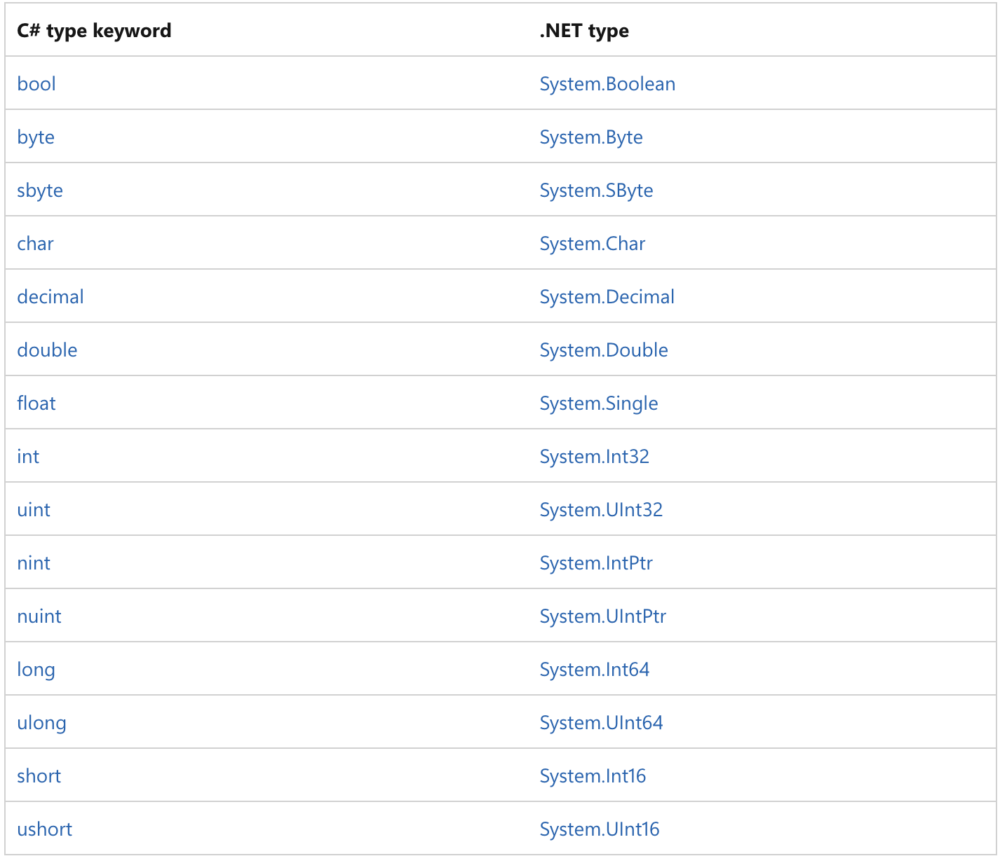
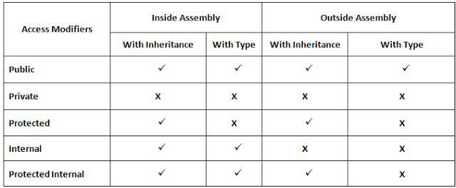

# C# review

## Modifiers access are using with class

## OOP (Object Orientation Programming)

- 4 pilars
    - Inheritance
    - Encapsulation
    - Polymorphism
    - Abstraction

## Class vs Interface

- Class:
- Interface:

## Abstract class vs Interface

- Abstract class:
- Interface: 
